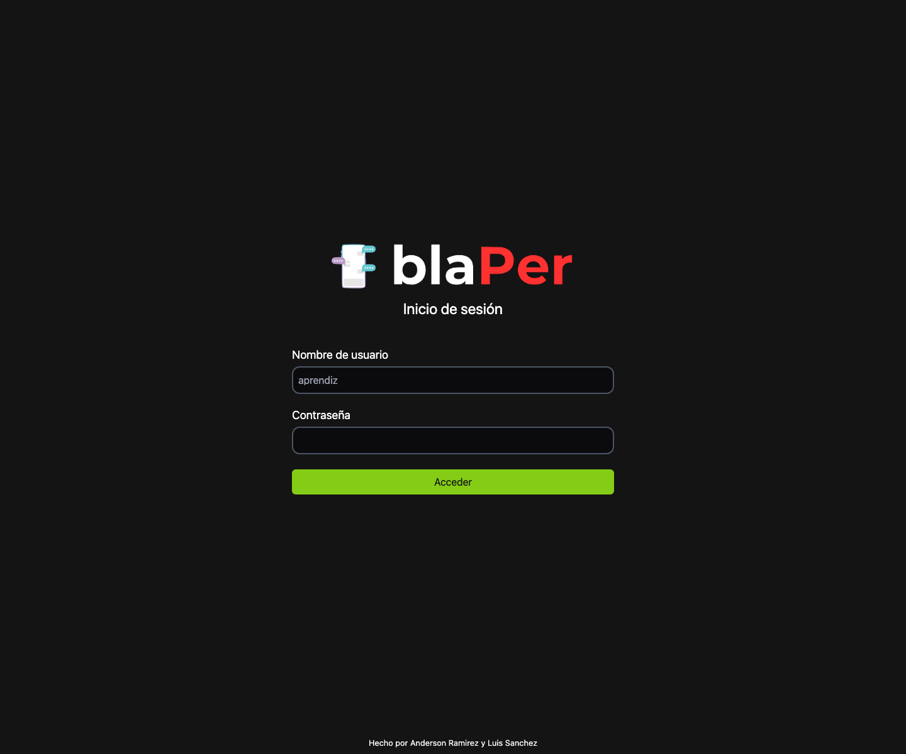

# Evidencia SENA - Login Frontend React

Frontend React/Vite para una evidencia SENA de autenticación. Consume una API Express en `http://localhost:4000/login` y protege una ruta de dashboard con estado de usuario en contexto/localStorage.

<p align="center">
  
</p>

## Resumen

La aplicación muestra una pantalla de login de Blaper, valida el usuario, envía credenciales al backend y redirige al panel cuando la autenticación es correcta.

## Características

- Login con React y formulario controlado.
- Validación de username sin caracteres especiales.
- Notificaciones de éxito/error.
- Context API para usuario autenticado.
- Persistencia de sesión en `localStorage`.
- Ruta protegida para dashboard/panel.
- Consumo HTTP con Axios.

## Stack

- React 18
- Vite 5
- React Router DOM
- Axios
- Tailwind CSS
- ESLint

## Backend Esperado

El frontend espera una API disponible en:

```text
POST http://localhost:4000/login
```

Payload esperado:

```json
{
  "username": "anderson",
  "password": "1234"
}
```

## Instalación

```bash
npm ci
npm run dev
```

Abrí `http://localhost:5173` o el puerto que indique Vite.

## Validación Local

La captura del README fue tomada desde la app ejecutándose en `http://127.0.0.1:3021`.

Comandos validados:

```bash
npm ci
npm run build
npm run dev -- --host 127.0.0.1 --port 3021
```

`npm run build` finalizó correctamente. La captura muestra el frontend aislado; para autenticar realmente se debe ejecutar también el backend Express en el puerto `4000`.

## Estructura

```text
src/components/Login.jsx          # Formulario de login
src/components/Panel.jsx          # Dashboard protegido
src/components/ProtectedRoute.jsx # Protección de rutas
src/hooks/UserProvider.jsx        # Contexto de usuario
src/db/                           # Datos SQL/JSON de referencia
```

## Autores

Anderson Ramirez y Luis Sanchez.
